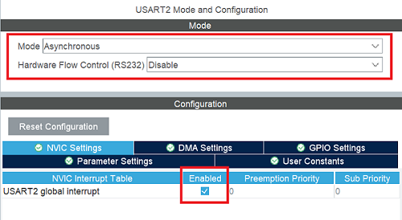

# Nextion-STM32-Library
Library for using Nextion HMI displays on STM32 MCUs with STM32Cube and HAL based projects. 

# Introduction
This library is created for STM32Cube projects using HAL libraries and depends on the "main.h" file created by STM32Cube software. Inclusion of "main.h" file makes this library compatible for all STM32 microcontroller families as long as the project is created with STM32Cube with HAL libraries selected. 

# Configuration
To properly use this library, a USART/UART peripheral of the MCU should be reserved to the Nextion display and configured in "Asynchronous" mode and the Global Interrupts should be activated in the STM32Cube IOC configuration as shown below;


# Usage

This library requires to be initialized in a few steps. Every code in this section is written in order, so you can follow this section as a step by step guide. 

Before getting started, don't forget to include the library in your project.
```
#include "Nextion.h"
```


First of all, the user should create a Nextion object. Then the multiple objects for the components can be created. 
```
//Object for the Nextion display
Nextion nextion;

//Objects for the components. Button1 is for example only. 
NexComp button1;
```


Then you could define the USART/UART Interrupt Callback function and including the NextionUpdate function. This enables the library to interpret the data without using proccessing power in the main loop. This part is copy pasteable and doesn't need any modifications, if you are using the same Nextion object name in your project. 
```
void HAL_UART_RxCpltCallback(UART_HandleTypeDef *huart)
{
	NextionUpdate(huart, &nextion);
}
```


You can also declare and define a callback function for any Nextion components you want. This function will be attached to the component in the next step
```
void buttonCallback()
{
  //Example function
	HAL_GPIO_TogglePin(LED_GPIO_Port, LED_Pin);
}
```


In the next step you can initialise the Nextion and the components you want. 
```
//Initialise Nextion with the configured UART handle
NextionInit(&nextion, &huart2);

//Register the component in the library with parameters: Nextion Object, Component Object, Page, ID, Callback Function On Press, Callback Function On Release
//If you don't want any callback function, pass NULL as the parameter 
NextionAddComp(&nextion, &button1, 0, 2, buttonCallback, NULL);
```

-Other functions of the library is still under development and this guide will be updated in the future. 

# Thanks
I want to thank the creators of the repositories below for the inspiration. 

- https://github.com/ITEAD-Thierry/NextionX
- https://github.com/itead/ITEADLIB_Arduino_Nextion
- https://github.com/guiguitz/STM32-Nextion-API
